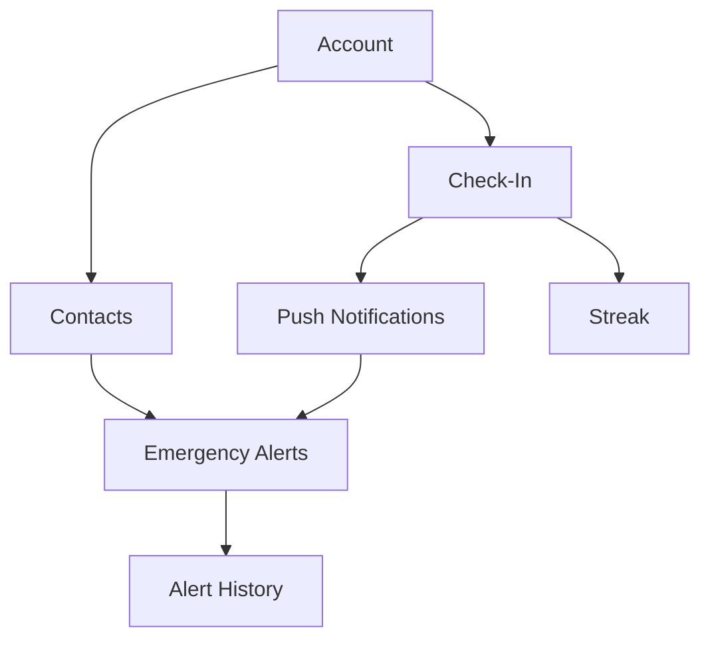

# 03 - Features

[← Back to PRD](../PRD.md) | [← Previous: User Stories](02-user-stories.md)

---

## MVP Features (v1.0)

### Feature Prioritization (MoSCoW)

| Priority | Meaning | Criteria |
|----------|---------|----------|
| **Must** | Required for launch | App is unusable without it |
| **Should** | High value | Significantly improves experience |
| **Could** | Nice to have | Adds polish |
| **Won't** | Not in v1 | Deferred to future versions |

---

## Must Have Features

### 1. Account Management

| Feature | Description | Status |
|---------|-------------|--------|
| Sign up with email | Create account with email + password | [x] Done |
| Sign in | Return to existing account | [x] Done |
| Password reset | Email-based password recovery | [x] Done |
| Sign out | Log out of account | [x] Done |
| Delete account | Remove all data permanently | [ ] Pending |

**Implementation Notes**:
- [x] Use Supabase Auth
- [ ] Email verification required
- [x] Session persistence (stay logged in)

---

### 2. Check-In System

| Feature | Description | Status |
|---------|-------------|--------|
| Check-in button | Large, prominent button on main screen | [ ] Pending |
| Countdown timer | Shows time until next check-in due | [ ] Pending |
| Check-in confirmation | Visual/haptic feedback on success | [ ] Pending |
| Check-in history | Record of all check-ins (backend) | [ ] Pending |

**UI Requirements**:
- Button must be >100pt diameter
- Single tap to complete (no confirmation dialog)
- Timer shows days/hours/minutes remaining
- Success animation (checkmark, color change)

**Business Logic**:
```
On check-in:
  1. Record timestamp in check_in_history
  2. Update user.last_check_in_at = now()
  3. Calculate user.next_check_in_due = now() + interval
  4. Clear any pending alert flags
```

---

### 3. Emergency Contacts

| Feature | Description | Status |
|---------|-------------|--------|
| Add contact | Name, phone (required), email (optional) | [ ] Pending |
| Edit contact | Update any field | [ ] Pending |
| Delete contact | Remove contact with confirmation | [ ] Pending |
| Contact list | View all saved contacts | [ ] Pending |
| Minimum validation | At least 1 contact required | [ ] Pending |

**Validation Rules**:
- Phone: Valid format (international supported)
- Email: Valid format if provided
- Name: Required, 1-100 characters
- Maximum contacts: 5 (v1)

---

### 4. Push Notifications

| Feature | Description | Status |
|---------|-------------|--------|
| Reminder at 24h | "Check in tomorrow to let contacts know you're OK" | [ ] Pending |
| Reminder at 6h | "Check-in due in 6 hours" | [ ] Pending |
| Reminder at 1h | "Last chance! Check in within 1 hour" | [ ] Pending |
| Overdue notice | "You missed your check-in. Contacts will be notified." | [ ] Pending |

**Implementation**:
- Firebase Cloud Messaging
- Scheduled via Supabase cron job
- Deep link to app on tap

---

### 5. Emergency Alerts

| Feature | Description | Status |
|---------|-------------|--------|
| SMS to contacts | Automated SMS when check-in missed | [ ] Pending |
| Email to contacts | Automated email when check-in missed | [ ] Pending |
| Grace period | 1 hour after deadline before alerting | [ ] Pending |
| Duplicate prevention | No repeat alerts within 24 hours | [ ] Pending |

**Alert Message Template**:
```
SMS:
[Name] hasn't checked in on their safety app in [X] days.
Please check on them.
Last active: [date]

Email:
Subject: Safety Check Required - [Name]
Body: [Same as SMS + app download link]
```

---

### 6. Settings

| Feature | Description | Status |
|---------|-------------|--------|
| Check-in interval | 1-7 days, default 2 | [ ] Pending |
| Notification preferences | Enable/disable reminders | [ ] Pending |
| Profile management | Update name, phone, email | [ ] Pending |
| About/Help | App info, FAQ, support | [ ] Pending |
| Profile display | Show current user info | [x] Done |
| Logout button | Sign out of account | [x] Done |

---

## Should Have Features

### 7. Onboarding Flow

| Feature | Description |
|---------|-------------|
| Welcome screen | App value proposition |
| Setup wizard | Guided flow: account → contact → interval |
| Skip option | Allow completing setup later |
| Progress indicator | Show steps remaining |

---

### 8. Contact Notifications

| Feature | Description |
|---------|-------------|
| Notify on add | Optional: Send SMS to contact when added |
| Explain the app | "You've been added as an emergency contact..." |

---

### 9. Check-In Streak

| Feature | Description |
|---------|-------------|
| Streak counter | Days of consecutive on-time check-ins |
| Streak display | Show on main screen |

---

## Could Have Features (v1.1+)

| Feature | Description | Complexity |
|---------|-------------|------------|
| Snooze button | Delay check-in by 12h (once per cycle) | Low |
| Contact tiers | Alert contact 1 first, then 2 after 6h | Medium |
| Check-in history screen | View past check-ins in app | Low |
| Home screen widget | Quick check-in without opening app | Medium |
| Dark mode | System-respecting dark theme | Low |
| Location sharing | Include location in alerts (optional) | Medium |

---

## Won't Have (Future Versions)

| Feature | Rationale | Potential Version |
|---------|-----------|-------------------|
| Apple Watch app | Adds complexity | v2.0 |
| WearOS app | Adds complexity | v2.0 |
| Elderly mode (large UI) | Different UX needs | v2.0 |
| Multiple languages | English-only launch | v2.0 |
| Two-way contact check | Contacts confirm user OK | v2.0 |
| Social features | Keep it simple | Never |
| Subscription model | One-time purchase | Never |

---

## Feature Specifications

### Check-In Button Specification

```
Component: CheckInButton

Visual:
- Shape: Circle
- Diameter: 120dp (minimum)
- Color: Primary brand color (deep red)
- Text: "I'M OK" or "CHECK IN"
- Font: Bold, 24sp

States:
- Default: Solid color, ready to tap
- Pressed: Darker shade, scale 0.95
- Success: Green, checkmark icon, scale 1.1
- Disabled: Gray (during cooldown)

Animation:
- On tap: Haptic feedback (medium)
- On success: Checkmark draws, confetti optional
- Duration: 300ms

Accessibility:
- contentDescription: "Check in button. Tap to confirm you are OK"
- Minimum touch target: 48dp
```

---

### Countdown Timer Specification

```
Component: CountdownTimer

Display Format:
- >24h: "X days, Y hours"
- <24h: "X hours, Y minutes"
- <1h: "X minutes remaining"
- Overdue: "OVERDUE - Check in now!"

Visual:
- Position: Above or below check-in button
- Color: Normal=gray, <6h=orange, <1h=red, overdue=red+pulse

Update Frequency:
- >1h: Every minute
- <1h: Every second
```

---

### Emergency Contact Card Specification

```
Component: ContactCard

Fields Displayed:
- Name (required)
- Phone (required, masked: ***-***-1234)
- Email (optional, masked: j***@gmail.com)
- Priority badge (if tiers implemented)

Actions:
- Tap: Edit contact
- Swipe left: Delete (with confirmation)
- Long press: Call directly (optional)
```

---

## Feature Dependencies



---

[Next: Technical Architecture →](04-technical-architecture.md)
